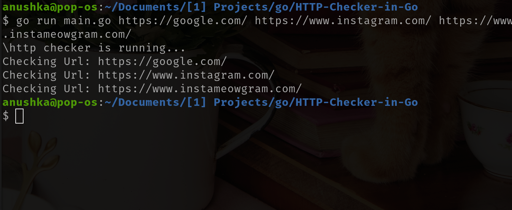
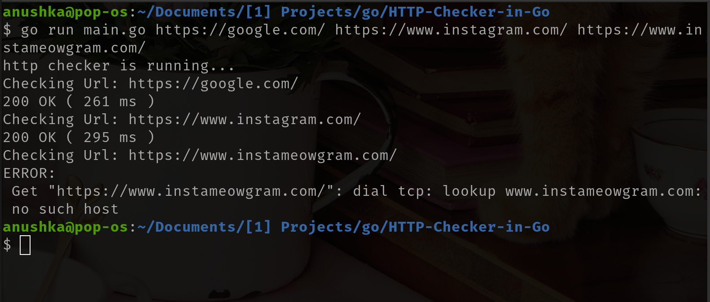
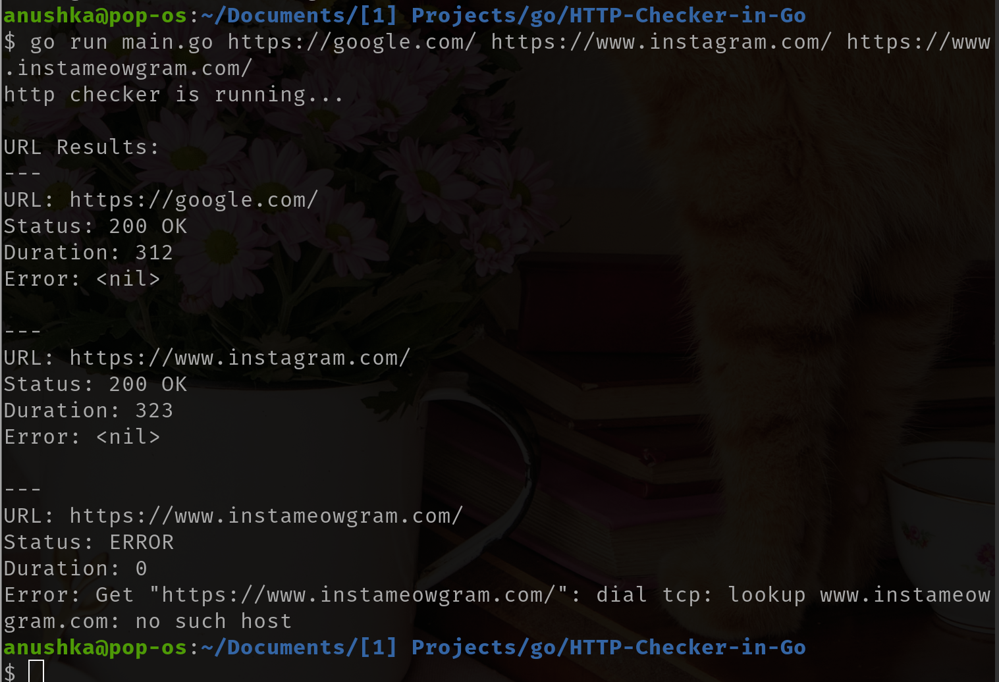

# HTTP-Checker-in-Go
A Command Line Based tool that checks the status of URLs passed as arguements

## Packages Used
- os
- fmt

> NOTE: The below step-wise plan is for my understanding and structure. Feel free to use it :\) 

## 🚀 Step-by-Step Plan
**Step 1: CLI Argument Handling**

Hint: You’ll find what you need in the os package. Don’t forget that the first element is always the command itself. Validate input length.

Checkpoint: Can your program reject empty input and print usage instructions?

**Step 2: HTTP Request Logic**

Hint: A standard library package lets you make a GET request with one line. Handle possible errors (what if the domain doesn't exist?). Time the request — think of what tool gives you nanosecond precision.

Checkpoint: Can you extract status code, status string, and duration in milliseconds?

**Step 3: Result Struct**

Hint: You'll eventually have multiple fields like status, duration, etc. Bundle them. Think: how would you return more than one thing from a function?

Checkpoint: Can you return a full "result object" from your checker logic?

**Step 4: Print Clean Output**

Hint:

Basic fmt.Printf will get you started. Want colored output? Dig into ANSI escape codes or third-party CLI packages — but make it optional.

Checkpoint:
Does your output make success and failure obvious at a glance?

**Step 5: Concurrency**

Hint:

You want to check multiple URLs without waiting for each. Use goroutines — but how will you collect the results in a safe way? Channels. Don’t forget to close them after.

Also, beware of race conditions and lost results.

Checkpoint:
Can you check 5 URLs in parallel and get 5 results printed?

**Step 6: Add Timeout**

Hint:

http.Get() is too simplistic. You need control. What alternative gives you access to timeout and redirect handling?

You’ll also want to make the timeout configurable via CLI flag.

Checkpoint:
Does your program fail fast on a dead URL with a user-defined timeout?

**Step 7: Add Flags**

Hint:

Check out the flag package. Support a --timeout or -t. Start small. Avoid overengineering.

Checkpoint:
Can the user run your tool like ./checker -t 2s https://example.com?

**Step 8: File Input (Optional)**

Hint:

Read a file line by line. You’ll need os.Open and a scanner from the bufio package. Trim each line before use.

Checkpoint:
Can you load 100 URLs from a file and process them?

**Step 9: Polishing**

- Is your output clean under stress?
- Do you handle invalid URLs?
- Do you measure response time accurately?
- Can you ship a binary with go build?

**Step 10: Extra Challenges (Optional)**

- Add JSON export via --output
- Retry failed checks
- Write unit tests
- Add spinner or progress display
- Limit concurrency with worker pool (bonus: use semaphore pattern)